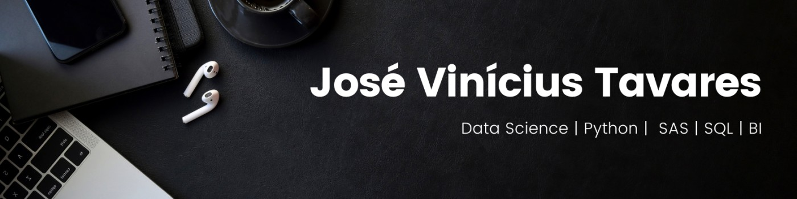

# Hi there! 🙋‍♂️

👨‍💻 Glad to meet you! I'm **José Vinícius Tavares**, a 24-year-old **Data Scientist** and **Business Analyst** from São Paulo, Brazil. I hold a degree in **Chemical Engineering** from the **University of São Paulo (USP)** and currently work as a **Business Analyst** at **Itaú Unibanco**, where I focus on modeling customer service strategies and leveraging data to drive business decisions.

My passion lies in **Machine Learning**, especially **Large Language Models (LLMs)**, and I'm constantly exploring new ways to apply data science to solve real-world problems. I recently earned a **Bronze Medal 🥉** at the **27th Itaú Data Battle**, a testament to my skills and dedication in the field.

---

## 🛠️ **Skills**

### **Technical Skills**
- **Programming**: Python (pandas, numpy, matplotlib, seaborn, scikit-learn, statsmodels, virtual environments, Flask), SQL
- **Machine Learning**: Classification, Regression, Clustering, Time Series, LLMs (RAG, summarization, sentiment analysis, prompt engineering)
- **Data Tools**: Alteryx, Hadoop, SAS, AWS (SageMaker, S3, Glue, Athena)
- **BI & Visualization**: Power BI, Tableau, Quicksight and SAS
- **Statistics**: Descriptive and Inferential Statistics

### **Soft Skills**
- **Communication**: Effective presenter and storyteller, experienced in executive presentations.
- **Teamwork**: Collaborative and adaptable, with a proven ability to work in cross-functional teams.
- **Self-Directed Learning**: Continuously improving my skills through courses, projects, and challenges.
- **Organization & Planning**: Strong ability to manage multiple projects and meet deadlines.

---

## 🚀 **Projects**

Here are some of the projects I've worked on:

### **Data Science Portfolio**
- **Classification**: Predictive models for customer churn, fraud detection, and more.
- **Regression**: Forecasting sales, demand, and other key metrics.
- **Clustering**: Customer segmentation and pattern recognition.
- **LLM Applications**: Building and fine-tuning large language models for specific use cases.

👉 [Check out my GitHub portfolio](https://github.com/tavaresjv) to explore these projects in detail!

---

## 🏆 **Achievements**

- **Bronze Medal 🥉** at the **27th Itaú Data Battle**.
- Successfully implemented data-driven strategies at Itaú, improving customer service models and operational efficiency.

---

## 📚 **Education**

- **Bachelor's in Chemical Engineering**  
  *University of São Paulo (USP)*  
  *São Paulo, Brazil*

---

## 🌍 **Let's Connect!**

I'm always open to discussing new opportunities, collaborations, or just chatting about data science and machine learning. Feel free to reach out:

- **LinkedIn**: [José Vinícius Tavares](https://www.linkedin.com/in/tavaresjv/)
- **GitHub**: [tavaresjv](https://github.com/tavaresjv)
- **Email**: [josevcatavares@gmail.com](mailto:josevcatavares@gmail.com)

Looking forward to connecting with you! 😊
